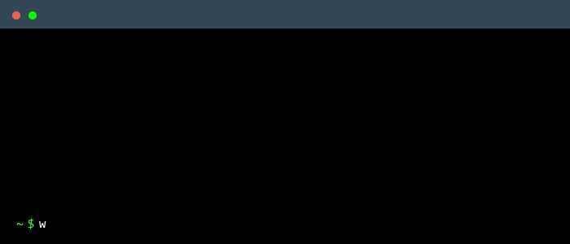
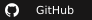

<p align="center"></p>

## Overview

```nix
{
  description = "La marge est trop étroite pour la contenir!";
  inputs = { };
  outputs = inputs: {
    greet = lib.mkGreet "Hi there! 👋";
    about = {
      nickname = "AstroNot233";
      pronouns = "他·He·Il";
      languages = with pkgs.lang; [ ch en fr ];
    };
  };
}
```

## Techstack

<p align="center">I am learning/using these coding languages!</p>

<p align="center">
  
  
  
  
  
  
  
</p>

## Preferences

| Fields       | Solutions |
|:------------:|:---------:|
| System       |  |
| Compositor   |  |
| Terminal     |  |
| Editor       |  |
| Shell        |  |
| Writing      |  |
| Repositories |  |

## Links

<p align="center">
  <a href="https://codeberg.org/AstroNot233"></a>
  <a href="https://github.com/AstroNot233"></a>
</p>
